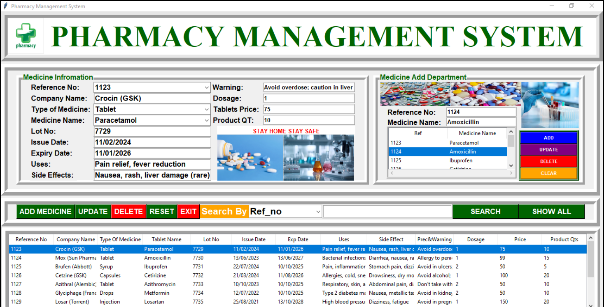

💊 Pharmacy Management System

A desktop-based Pharmacy Management System built using Python (Tkinter) for the graphical interface and MySQL for database management.

The application allows efficient management of medicine inventory through an interactive GUI and database integration.



🚀 Features

Add, update, and delete medicines

Manage detailed pharmacy records

Search functionality for quick record retrieval

Structured tabular data display using Treeview

MySQL database integration

Clean and organized Tkinter GUI layout

🛠️ Tech Stack

Python 3

Tkinter (GUI)

MySQL

mysql-connector-python

Pillow (PIL)

🗄️ Database Structure
Database: mydata
Table: pharma
```
CREATE TABLE pharma (
    Ref VARCHAR(50) PRIMARY KEY,
    MedName VARCHAR(100)
);
```

Table: pharmacy
```
CREATE TABLE pharmacy (
    ref_no VARCHAR(50) PRIMARY KEY,
    CmpName VARCHAR(100),
    TypeMed VARCHAR(50),
    MedName VARCHAR(100),
    LotNo VARCHAR(50),
    Issuedate VARCHAR(50),
    Expdate VARCHAR(50),
    Uses VARCHAR(200),
    Sideeffect VARCHAR(200),
    Warning VARCHAR(200),
    Dosage VARCHAR(50),
    Price VARCHAR(50),
    ProductQT VARCHAR(50)
);
```

⚙️ Installation & Setup
1️⃣ Clone the repository
```
git clone https://github.com/2004M-chitranshu791113/Pharmacy-Management-System.git
cd Pharmacy-Management-System
```

2️⃣ Install dependencies
pip install mysql-connector-python pillow

3️⃣ Configure MySQL

Create database mydata

Create required tables (see above)

Update MySQL credentials in the Python file if necessary

4️⃣ Run the application
```
python pharma.py
```

📌 Future Improvements

Input validation enhancements

Date format validation

Export data to CSV

Authentication system

Improved UI responsiveness
